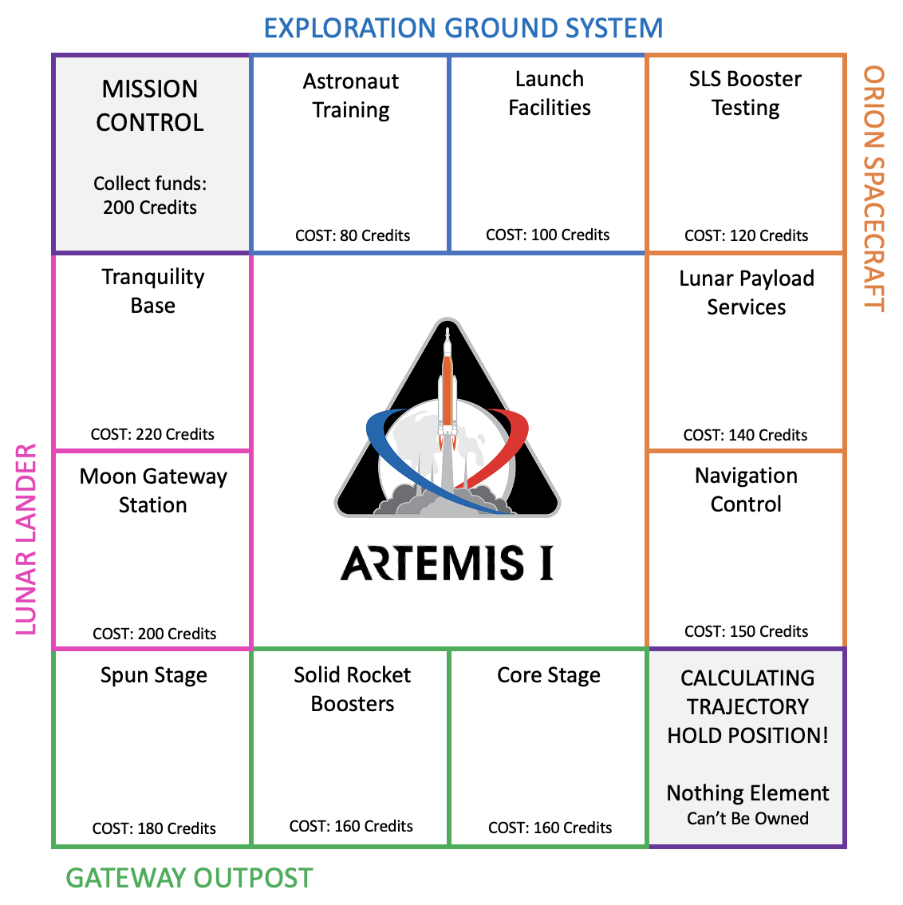
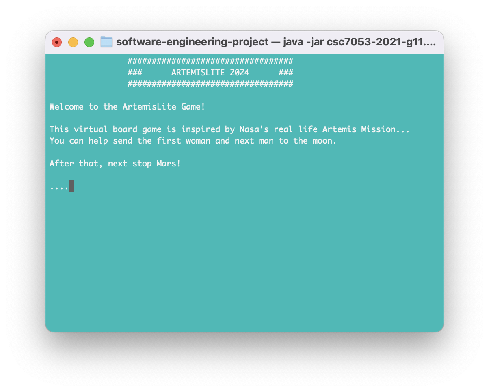
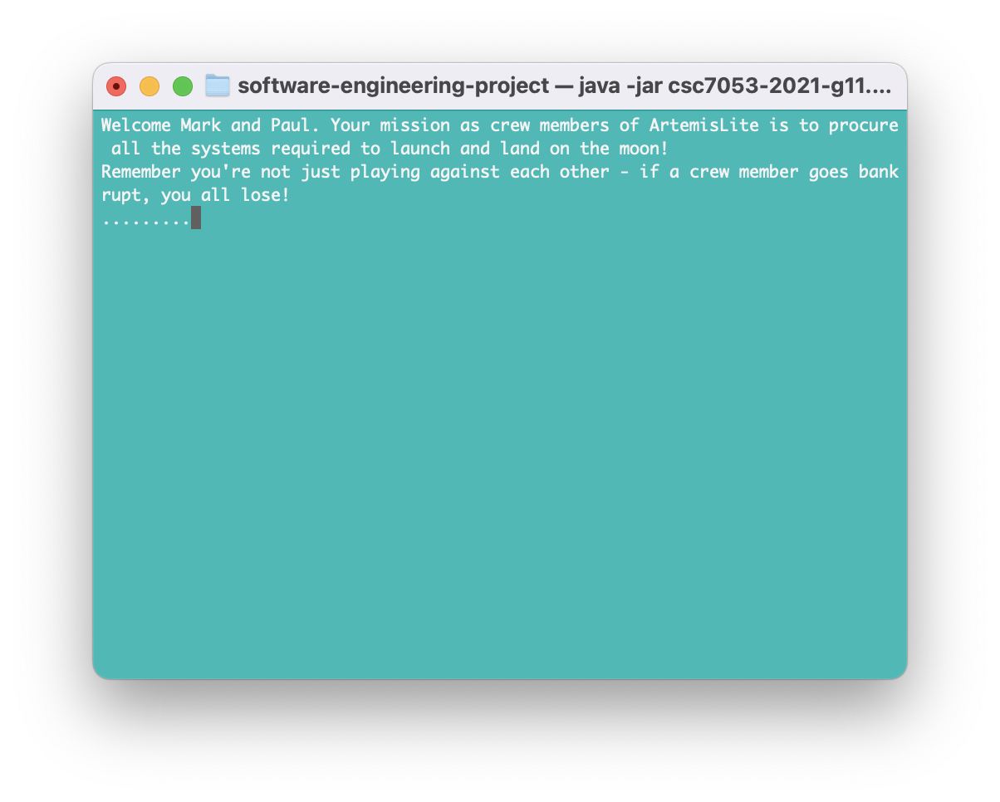
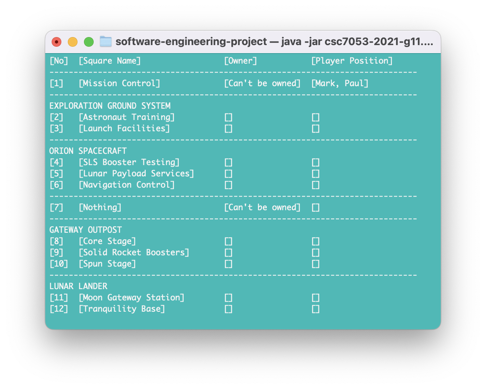

**ArtemisLite 2021**

A University group project to create a text based java game. Themed around NASA's Artemis space exploration mission.

**Game Play Screens**

Authors:
- Mark Graham
- Matthew Gregg
- Amit Jayaprakash
- Darragh Kieran

